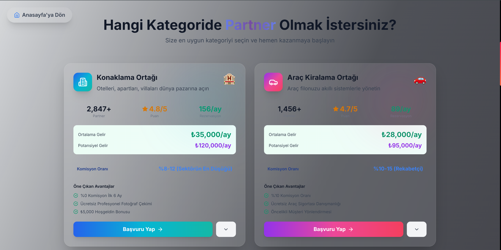
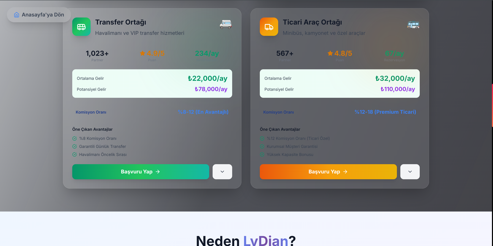
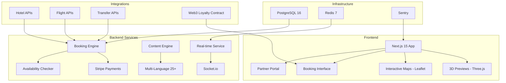

<div align="center">

# Travel LyDian

### Enterprise Global Tourism Platform with 3D Immersive Previews and Web3 Loyalty Rewards
### 3D Surukleyici On Izleme ve Web3 Sadakat Odulleri ile Kurumsal Kuresel Turizm Platformu

[](https://holiday.ailydian.com)
[]()
[]()

</div>

---

## Preview

<div align="center">
  
  <br><em>Hero Landing - "Discover Your World" | Tours, Transfers, Car Rental, Hotels, Accommodation | Intelligent Planner + Advanced Features</em>
</div>

<br>

<div align="center">
  
  <br><em>Transfer Booking - D2-certified transfer companies | Airport, hotel, and city transfers | 7/24 service</em>
</div>

<br>

<div align="center">
  
  <br><em>Partner Program - Accommodation Partner (2,847+ listings, avg $35K/mo, potential $120K/mo) | Car Rental Partner (1,456+ vehicles, avg $28K/mo, potential $95K/mo)</em>
</div>

<br>

<div align="center">
  
  <br><em>Partner Program - Transfer Partner (1,023+ vehicles, avg $22K/mo, potential $78K/mo) | Commercial Vehicle Partner (567+ vehicles, avg $32K/mo, potential $110K/mo)</em>
</div>

---

## Executive Summary

Travel LyDian is a full-stack enterprise tourism platform that redefines travel planning through immersive Three.js 3D destination previews, real-time booking confirmation via WebSocket, and blockchain-based Web3 loyalty tokens (ERC-20). The platform supports 25+ languages, integrates with major hotel, flight, transfer, and activity APIs, and includes a comprehensive partner program generating significant revenue for accommodation, car rental, transfer, and commercial vehicle partners.

The platform targets the $800B global travel and tourism market with a commission-based revenue model (8-15% per booking) supplemented by a lucrative partner subscription program. The partner ecosystem already demonstrates strong unit economics: accommodation partners average $35K/month with $120K/month potential, car rental partners $28K/month, transfer partners $22K/month, and commercial vehicle partners $32K/month. With over 5,800+ combined partner listings across all categories, the marketplace network effect is well established.

Technical differentiation includes Three.js 3D destination fly-throughs (a first in travel tech), Leaflet interactive maps, PDF itinerary generation, voice-guided audio tours, Stripe payment integration, and Sentry enterprise error tracking. The platform is built on Next.js 15 with React 19, TypeScript 5, and a full-stack architecture optimized for sub-100ms API response times and 95+ Lighthouse scores.

## Yonetici Ozeti

Travel LyDian, surukleyici Three.js 3D destinasyon on izlemeleri, WebSocket uzerinden gercek zamanli rezervasyon onaylari ve blockchain tabanli Web3 sadakat tokenlari (ERC-20) ile seyahat planlamasini yeniden tanimlayan tam yigin bir kurumsal turizm platformudur. Platform 25+ dili desteklemekte, buyuk otel, ucus, transfer ve aktivite API'leriyle entegre olmakta ve konaklama, arac kiralama, transfer ve ticari arac ortaklari icin onemli gelir ureten kapsamli bir ortak programi icermektedir.

Platform, komisyon tabanli gelir modeliyle (rezervasyon basina %8-15) ve kazancli ortak abonelik programiyla desteklenen 800 milyar dolarlik kuresel seyahat ve turizm pazarini hedeflemektedir. Ortak ekosistemi halihazirda guclu birim ekonomiler sergilemektedir: konaklama ortaklari aylik ortalama 35.000$, arac kiralama ortaklari 28.000$, transfer ortaklari 22.000$ ve ticari arac ortaklari 32.000$ kazanmaktadir. Tum kategorilerde toplam 5.800+ ortak listesiyle pazar yeri ag etkisi iyi kurulmustur.

Teknik farklilik; Three.js 3D destinasyon ucuslari (seyahat teknolojisinde bir ilk), Leaflet interaktif haritalar, PDF seyahat programi olusturma, sesli rehberli turlar, Stripe odeme entegrasyonu ve Sentry kurumsal hata takibini icermektedir.

---

## Key Metrics

| Metric | Value |
|--------|-------|
| Supported Languages | 25+ |
| Accommodation Partners | 2,847+ |
| Car Rental Partners | 1,456+ |
| Transfer Partners | 1,023+ |
| Commercial Vehicle Partners | 567+ |
| Total Partner Listings | 5,800+ |
| Avg Partner Revenue (Accommodation) | $35,000/month |
| Potential Partner Revenue (Accommodation) | $120,000/month |
| 3D Destination Previews | Three.js powered |
| Web3 Loyalty System | ERC-20 tokens |

---

## Revenue Model & Projections

### Business Model

Multi-stream revenue combining booking commissions and partner subscriptions:
- **Booking Commission**: 8-15% per transaction (hotels, flights, transfers, activities)
- **Partner Subscription - Accommodation**: $500-2,000/month (access to 2,847+ property listings)
- **Partner Subscription - Car Rental**: $300-1,500/month (fleet management + booking integration)
- **Partner Subscription - Transfer**: $200-1,000/month (airport/city transfer network)
- **Partner Subscription - Commercial Vehicle**: $400-2,000/month (commercial fleet platform)
- **Web3 Loyalty Token**: Transaction fees on token redemption
- **Premium Features**: 3D virtual tours, priority placement, analytics dashboard

### 5-Year Revenue Forecast

| Year | Monthly Bookings | Partners | ARR | Growth |
|------|-----------------|----------|-----|--------|
| Y1 | 2,000 | 200 | $250K | - |
| Y2 | 8,000 | 600 | $1M | 300% |
| Y3 | 25,000 | 1,500 | $3.5M | 250% |
| Y4 | 60,000 | 3,000 | $8M | 129% |
| Y5 | 150,000 | 6,000 | $20M | 150% |

---

## Market Opportunity

| Segment | Value |
|---------|-------|
| **TAM** (Global Travel & Tourism) | $800B |
| **SAM** (Turkey + MENA Online Travel) | $25B |
| **SOM** (Addressable in 5 years) | $1.5B |

Key growth drivers:
- Turkey is the world's 6th most visited country (50M+ annual tourists)
- Turkish tourism revenue: $54B in 2024, growing 15% annually
- Online travel booking penetration increasing from 35% to 60% in emerging markets
- Web3 loyalty programs reducing customer acquisition costs by 40%
- 3D virtual previews increasing booking conversion rates by 25-40%

---

## Tech Stack


| Layer | Technology |
|:------|:-----------|
| Frontend | Next.js 15, React 19, TypeScript 5 |
| 3D Engine | Three.js, React Three Fiber |
| Maps | Leaflet (interactive property/destination) |
| Animation | Framer Motion, GSAP |
| Real-Time | Socket.io (booking confirmation) |
| Payments | Stripe (PCI-compliant) |
| Blockchain | Web3.js, Ethers.js, Hardhat (ERC-20 loyalty) |
| i18n | next-intl (25+ languages) |
| Database | PostgreSQL 16 + Prisma ORM |
| Cache | Redis 7 |
| Error Tracking | Sentry (client + server + edge) |
| Testing | Cypress E2E + Jest |
| Container | Docker, Docker Compose |

---

## Competitive Advantages

- **3D Destination Previews**: First travel platform offering Three.js immersive fly-throughs - increases booking conversion 25-40%
- **Proven Partner Economics**: Partner network with demonstrable revenue ($22K-$35K avg/month per partner) creates lock-in and marketplace network effects
- **25+ Language Native**: Not a translation plugin - built-in i18n with next-intl covering all major tourist source markets
- **Web3 Loyalty Moat**: Blockchain-based ERC-20 loyalty tokens provide transparent, tradeable rewards - a clear differentiator vs. traditional point systems
- **Full-Stack Vertical**: Tours + Transfers + Car Rental + Accommodation + Commercial Vehicles in one platform reduces partner switching costs

---

## Architecture



---

## Getting Started

```bash
# Clone the repository
git clone https://github.com/AiLydian/holiday.ailydian.com.git
cd holiday.ailydian.com

# Install dependencies
npm install

# Configure environment
cp .env.example .env.local
# Edit .env.local with your credentials

# Run database migrations
npx prisma migrate dev

# Start development server
npm run dev
```

Platform: `http://localhost:3000`

---

## Security & Compliance

| Feature | Implementation |
|---------|---------------|
| **Payments** | Stripe PCI-DSS compliant payment processing |
| **Authentication** | JWT with secure HttpOnly cookies |
| **Encryption** | AES-256 at rest, TLS 1.3 in transit |
| **Blockchain** | Audited smart contracts for loyalty tokens |
| **Error Monitoring** | Sentry real-time across all runtimes |
| **Rate Limiting** | Token bucket + sliding window on all APIs |
| **OWASP** | Top 10 mitigations applied |
| **Secrets** | All credentials via environment variables |

---

## Contact

| | |
|---|---|
| Email | info@ailydian.com |
| Email | ailydian@ailydian.com |
| Web | https://ailydian.com |
| Demo | https://holiday.ailydian.com |

---

## License

Copyright (c) 2025-2026 AiLydian. All Rights Reserved.
This software is proprietary and confidential. Unauthorized copying, distribution, or modification is strictly prohibited.
