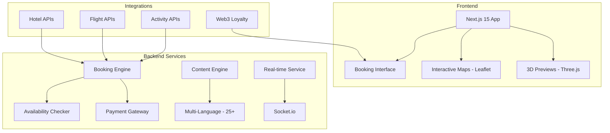

# Travel LyDian - Enterprise Global Tourism Platform

> 3D Immersive Travel Experience with Real-Time Booking and Web3 Loyalty

[](LICENSE)
[](https://nextjs.org/)
[](https://react.dev/)
[](https://threejs.org/)
[](https://www.typescriptlang.org/)
[](https://www.postgresql.org/)

## Overview

Travel LyDian is an enterprise tourism platform that redefines travel planning through immersive 3D destination previews, real-time booking confirmation, and Web3 loyalty tokens. The platform supports 25+ languages, integrates multiple hotel, flight, and activity APIs, and delivers enterprise-grade reliability with Sentry error tracking.

## Platform Architecture



## Key Features

- **Immersive 3D Destination Previews** — Three.js + React Three Fiber powered virtual destination tours before booking
- **Real-Time Booking Confirmation** — WebSocket (Socket.io) based instant booking confirmations
- **Interactive Maps** — Leaflet integration for property and destination discovery
- **25+ Language Support** — Multi-language platform via next-intl with 25+ supported locales
- **Web3 Loyalty Tokens** — Blockchain-based loyalty point system (Web3.js, Hardhat)
- **PDF Trip Itinerary Generation** — Automated itinerary PDF creation for travelers
- **Voice-Guided Tours** — Audio tour assistant for destinations
- **Enterprise Error Tracking** — Sentry integration across client, server, and edge runtimes

## Technology Stack

| Layer | Technology |
|---|---|
| Frontend Framework | Next.js 15, React 19 |
| 3D Engine | Three.js, React Three Fiber |
| Maps | Leaflet |
| Animation | Framer Motion, GSAP |
| Real-Time | Socket.io |
| Internationalization | next-intl (25+ languages) |
| Blockchain | Web3.js, Ethers.js, Hardhat |
| Database | PostgreSQL 16, Prisma ORM |
| Error Tracking | Sentry |
| Language | TypeScript |
| Container | Docker |

## Project Structure

```
holiday.ailydian.com/
├── src/
│   ├── app/                  # Next.js 15 App Router
│   │   ├── [locale]/         # Localized routes (25+ languages)
│   │   ├── api/              # API routes
│   │   └── (booking)/        # Booking flow pages
│   ├── components/
│   │   ├── 3d/               # Three.js destination previews
│   │   ├── maps/             # Leaflet map components
│   │   ├── booking/          # Booking UI components
│   │   └── ui/               # Shared UI library
│   ├── lib/
│   │   ├── ai/               # Multi-provider language model router
│   │   ├── booking/          # Booking engine
│   │   ├── web3/             # Blockchain loyalty system
│   │   └── i18n/             # Internationalization utilities
│   └── stores/               # Zustand state management
├── contracts/                # Hardhat smart contracts
├── prisma/                   # Database schema
├── public/
│   └── locales/              # Translation files (25+ languages)
└── cypress/                  # End-to-end tests
```

## Getting Started

### Prerequisites

- Node.js 20+
- PostgreSQL 16
- Redis 7
- A Web3-compatible wallet (for loyalty token features)

### Installation

```bash
# Clone the repository
git clone https://github.com/lydianai/holiday.ailydian.com.git
cd holiday.ailydian.com

# Install dependencies
npm install

# Configure environment variables
cp .env.example .env.local

# Run database migrations
npx prisma migrate dev

# Start development server
npm run dev
```

The platform will be available at `http://localhost:3000`.

## Environment Variables

| Variable | Description | Required |
|---|---|---|
| `DATABASE_URL` | PostgreSQL connection string | Yes |
| `REDIS_URL` | Redis connection string | Yes |
| `NEXTAUTH_SECRET` | Authentication secret | Yes |
| `NEXTAUTH_URL` | Application base URL | Yes |
| `LLM_API_KEY` | Language model provider API key | Yes |
| `LLM_MODEL_PRIMARY` | Primary language model identifier | Yes |
| `LLM_MODEL_FAST` | Fast language model identifier | Yes |
| `LLM_BASE_URL` | Language model provider base URL | No |
| `ZAI_API_KEY` | ZAI provider API key | No |
| `ZAI_MODEL_BALANCED` | ZAI balanced model identifier | No |
| `ZAI_MODEL_FAST` | ZAI fast model identifier | No |
| `STRIPE_SECRET_KEY` | Stripe payment secret key | Yes |
| `STRIPE_WEBHOOK_SECRET` | Stripe webhook signing secret | Yes |
| `SENTRY_DSN` | Sentry error tracking DSN | Yes |
| `BLOCKCHAIN_RPC_URL` | Web3 RPC endpoint | No |
| `LOYALTY_CONTRACT_ADDRESS` | Loyalty token contract address | No |

## Supported Languages

The platform supports 25+ languages including:

Turkish, English, German, Russian, Arabic, Persian, French, Greek, Spanish, Italian, Portuguese, Dutch, Polish, Czech, Romanian, Hungarian, Bulgarian, Croatian, Slovak, Slovenian, Ukrainian, Hebrew, Chinese (Simplified), Japanese, Korean

## 3D Experience

The Three.js powered destination preview system provides:

- **Virtual Fly-Through** — Camera animation through destination landmarks
- **Interactive 360 Views** — Panoramic hotel and venue previews
- **Point of Interest Overlay** — 3D pins for restaurants, attractions, and services
- **Day/Night Cycle** — Dynamic lighting for realistic time-of-day representation

## Booking System

The real-time booking engine integrates with:

- **Hotels** — Major hotel aggregator APIs with real-time availability
- **Flights** — Flight search and booking APIs
- **Activities** — Experience and tour booking APIs
- **Transfers** — Airport and city transfer booking

## Web3 Loyalty System

- Loyalty points issued as ERC-20 tokens on the loyalty contract
- Token rewards for bookings, reviews, and referrals
- Redemption for discounts, upgrades, and exclusive experiences
- Transparent on-chain transaction history

## Security

See [SECURITY.md](SECURITY.md) for the vulnerability reporting policy.

- JWT session management with secure HttpOnly cookies
- All API credentials managed as environment variables (never hardcoded)
- Model provider identity protected via runtime environment resolution
- AES-256 encryption at rest, TLS 1.3 in transit
- Sentry integrated for real-time error monitoring
- OWASP Top 10 mitigations applied

## License

Copyright (c) 2024-2026 Lydian (AiLydian). All Rights Reserved.

This is proprietary software. See [LICENSE](LICENSE) for full terms.

---

Built by [AiLydian](https://www.ailydian.com)
